# Vim キーバインド

根本 将治

---

## **VIM** とは

>>>

**CUI** ベースの **テキストエディタ**

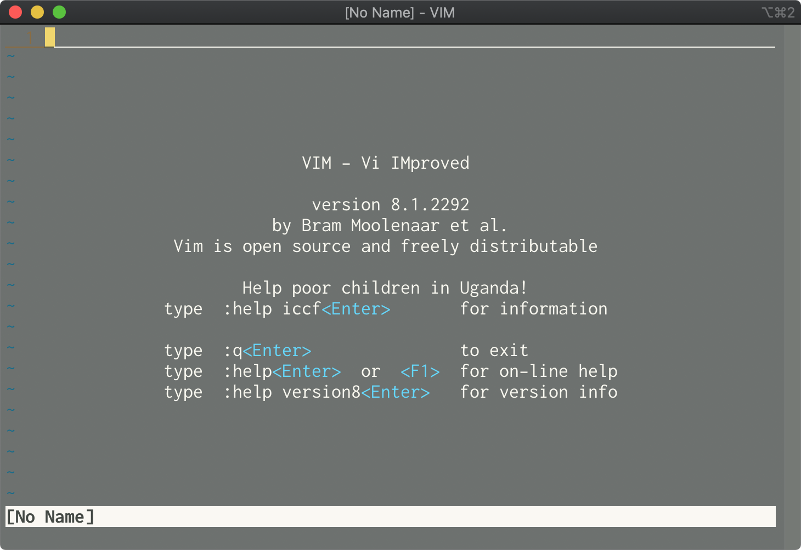

>>>

### GOOD

- **Linux** で **標準搭載** されている事が多い
- とにかく **軽い**！！
- 高い **カスタマイズ性**
- **高速編集** を可能にする **洗練された** キーバインド
- Geek(技術オタク)っぽくて **かっこいい**

>>>

### BAD

- **初学者** 泣かせの **非人道的** なキーバインド
- **日本語入力** と **相性が悪い**
- **カスタマイズ** が **複雑**
- カスタマイズしないと**IDE** と比べて **貧弱**
  - **好きなIDE** で **Vim キーバインド**を使えば**最強**！？

---

## 様々な環境で Vim キーバインド

| 環境                 | 実現方法          |
| -------------------- | ----------------- |
| **VS Code**          | Vim (拡張)        |
| **SublimeText3**     | Vintageous (拡張) |
| **VS 2019**          | VsVim (拡張)      |
| **IntelliJ IDEA**    | IdeaVim (拡張)    |
| **zsh(シェル)**      | bindkey -v (標準) |
| **Chrome(ブラウザ)** | Vimium (拡張)     |

---

## 操作方法

>>>

### モード

Vimは **モード** という状態をもつ  
モードによって **できる事が違う** ため  
モードを **切り替えながら** 編集を行う

>>>

| モード名         | できる事                                                        |
| ---------------- | --------------------------------------------------------------- |
| **コマンド**     | カーソル移動   コピー/カット/ペースト   マクロ記録/実行 |
| **テキスト入力** | テキスト編集                                                    |
| **ex**           | エディタコマンドの実行   ファイル操作   テキスト置換      |
| **ヴィジュアル**   | テキストの選択、コピー、削除                                    |
| **検索モード**   | テキストの検索                                                  |

>>>

#### コマンドモード

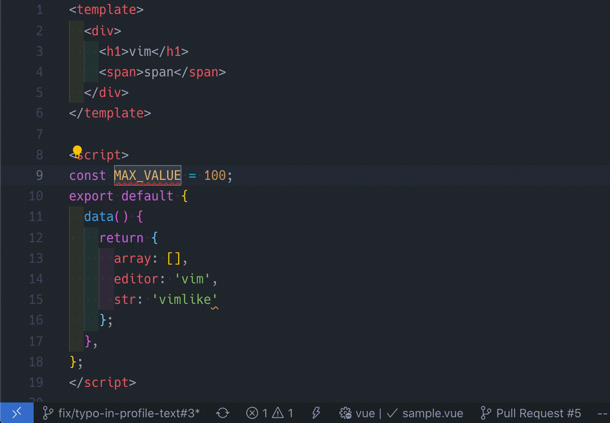

>>>

#### テキスト入力モード

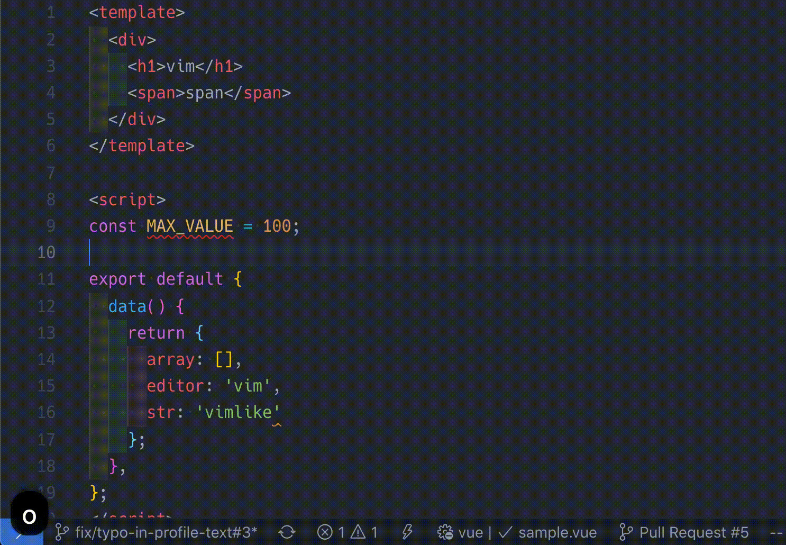

>>>

#### ヴィジュアルモード

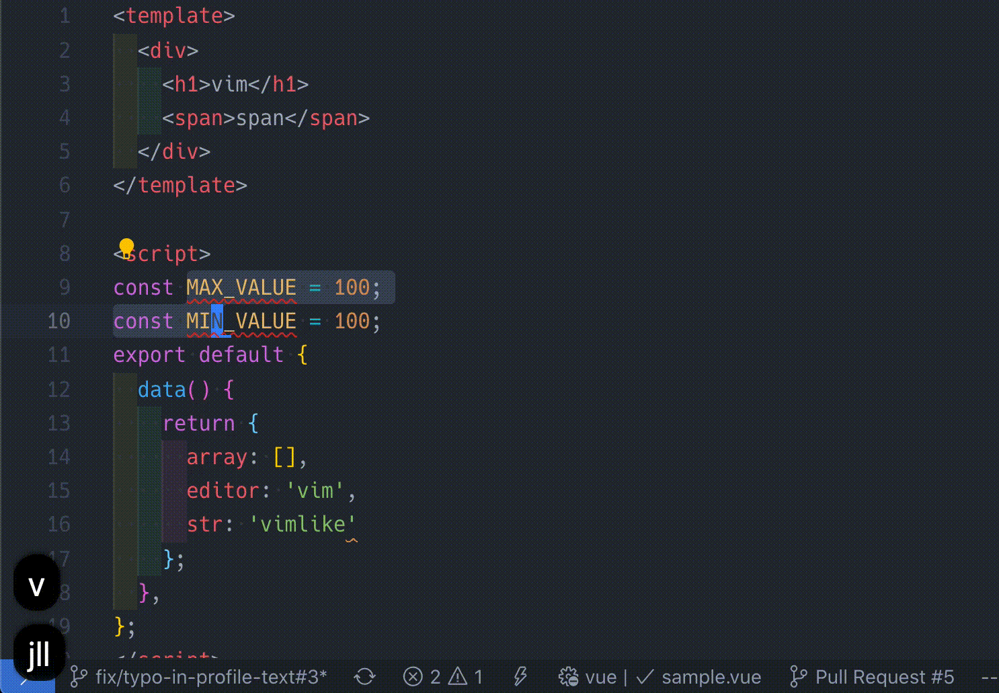

---

### <small style="color:white">これだけ覚えておけば乗り切れる</small>  **基本コマンド**

>>>

#### カーソル移動

| 操作                                           | キー |
| ---------------------------------------------- | ---- |
| **←**                                          | h    |
| **↓**                                          | j    |
| **↑**                                          | k    |
| **→**                                          | l    |
| **行頭へ**  <small>(インデント除く)</small> | ^    |
| **行末へ**                                     | $    |

>>>

#### 編集操作

| 操作                                                     | キー  |
| -------------------------------------------------------- | ----- |
| **テキスト入力モードへ**                                 | i     |
| **一文字削除**                                           | x     |
| **ペースト**                                             | p     |
| **ビジュアルモードへ**  <small>(部分選択)</small>     | v     |
| **コピー**  <small>(ビジュアルモードで選択中)</small> | y  |

>>>

#### 保存と終了

| 操作                   | キー |
| ---------------------- | ---- |
| **保存**               | :w   |
| **終了**               | :q   |
| **保存して終了**       | :wq  |
| **変更を破棄して終了** | :q!  |

>>>

#### 最も重要

| 操作                 | キー |
| -------------------- | ---- |
| **コマンドモードへ** | ESC  |

操作を受け付けなくなった時や  
思った通りに動かない時は  
 **ESCキー連打**

---

### **ホント** は **こんな事** できます

>>>

#### タグの中身を編集

cit  
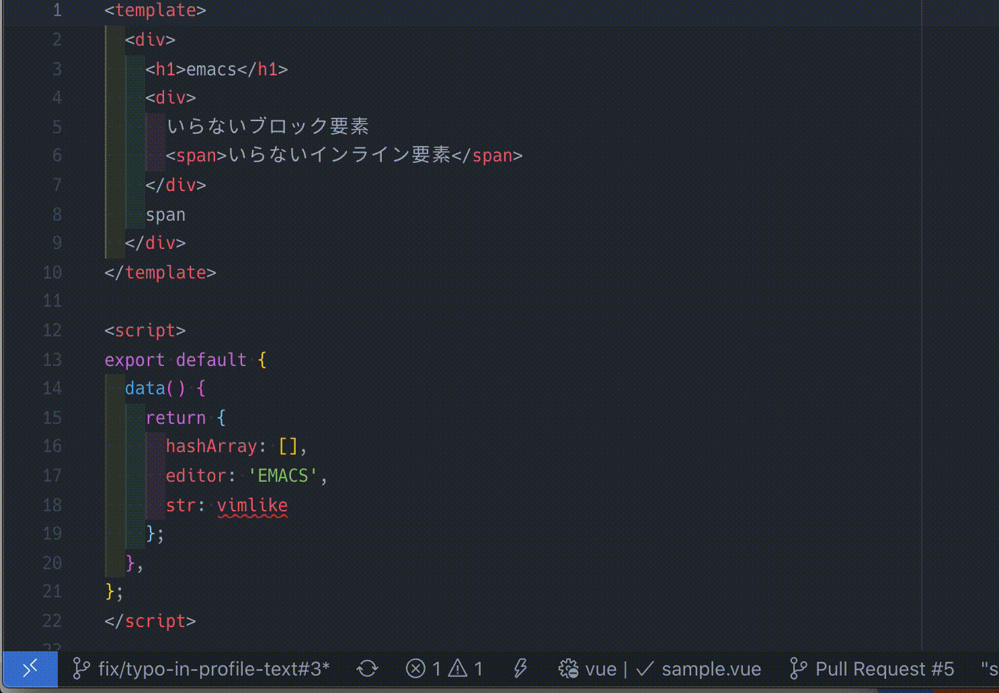

>>>

#### タグを中身ごと削除

dat  

>>>

#### 単語をタグで囲む

ysiw  
<small>(surround vim plugin)</small>  
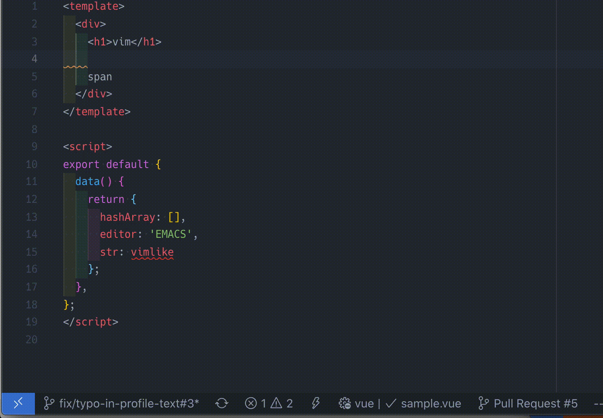

>>>

#### 小文字の文字列を大文字に変換

gUiw  
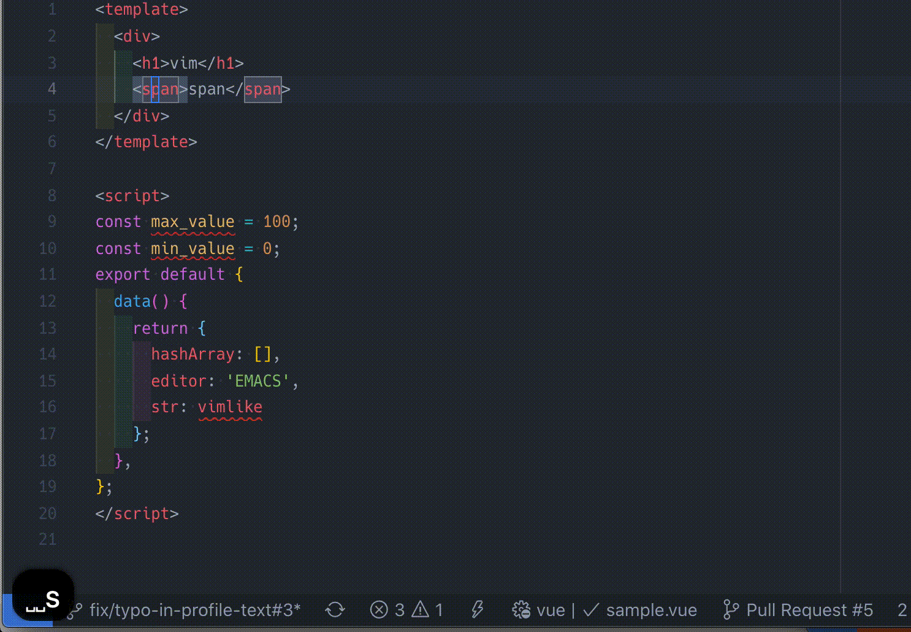

>>>

#### 行削除

dd  
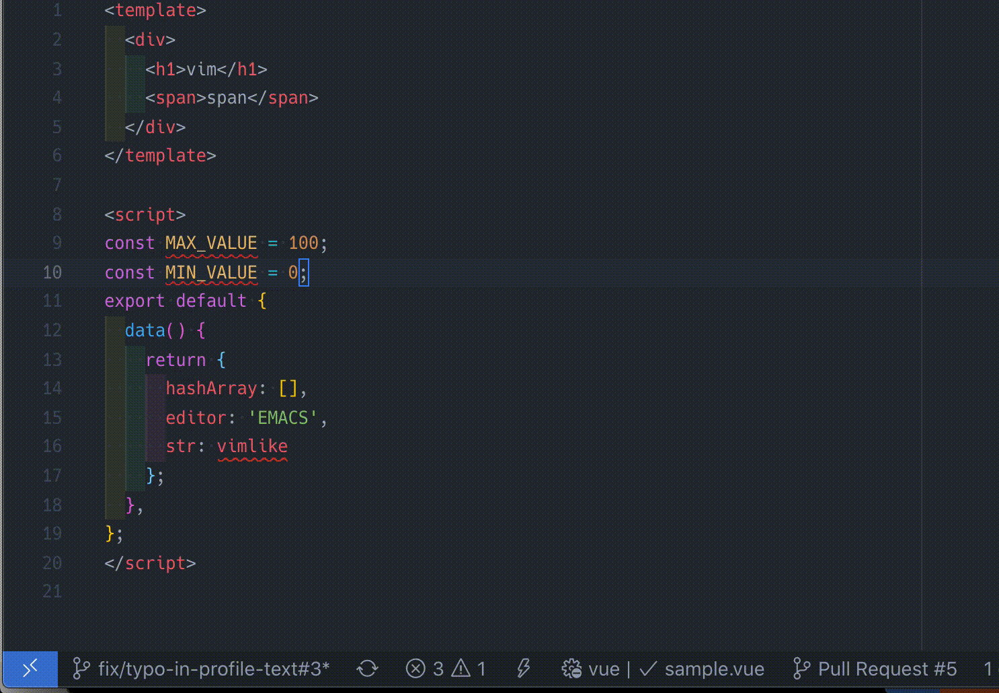

>>>

#### 単語を編集

ciw  
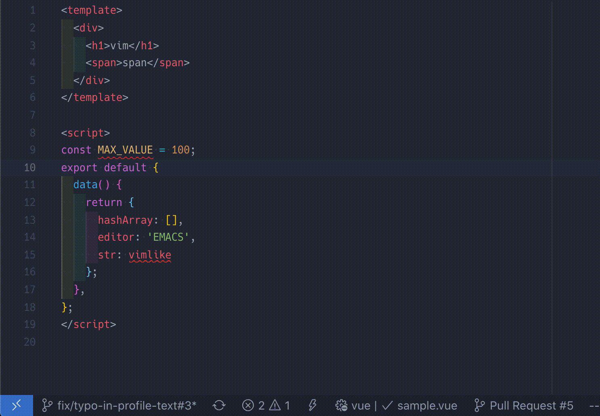

>>>

#### シングルクオート内を修正

ci\'  
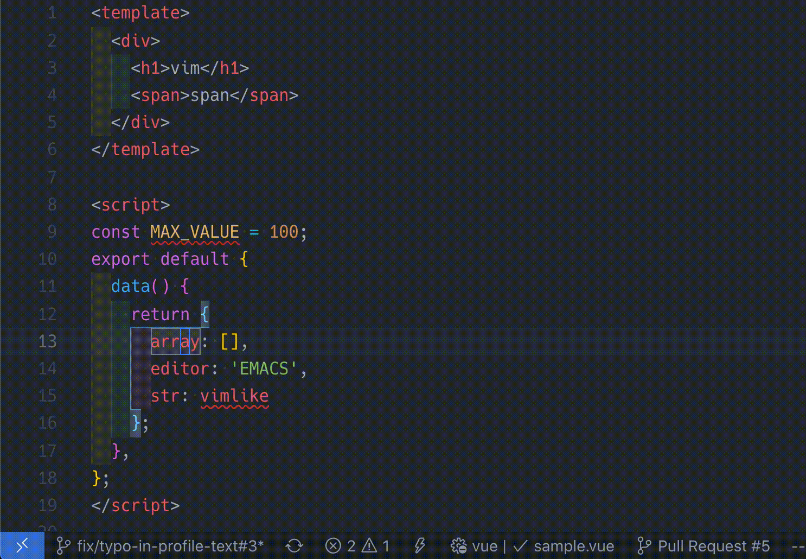

>>>

#### 単語を''で囲む

ysiw\' 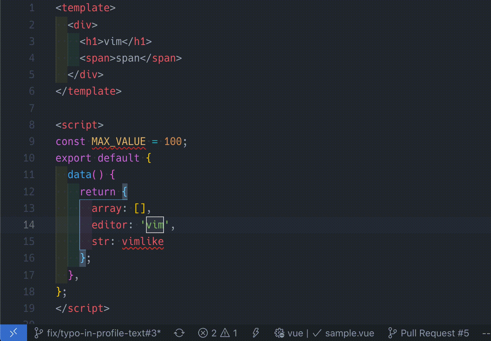

---

## 参考文献

- [名無しのvim使い(WEB)](https://nanasi.jp/articles/howto/user-manual/user-manual-mode.html#:~:text=vim%E3%82%A8%E3%83%87%E3%82%A3%E3%82%BF%E3%81%A7%E3%81%AF%E3%80%81%E3%82%AB%E3%83%BC%E3%82%BD%E3%83%AB%E3%81%AE,%E5%B7%A6%E3%81%AB%E7%A7%BB%E5%8B%95%E3%81%97%E3%81%BE%E3%81%99%E3%80%82%EF%BC%89&text=vim%E3%82%A8%E3%83%87%E3%82%A3%E3%82%BF%E3%81%AE%E3%83%A2%E3%83%BC%E3%83%89%E3%82%92,ESC%20%E3%82%AD%E3%83%BC%E3%82%92%E6%8A%BC%E3%81%97%E3%81%BE%E3%81%99%E3%80%82)
- [実践Vim 思考のスピードで編集しよう！(書籍)](https://www.amazon.co.jp/dp/B00HWLJI3U/ref=dp-kindle-redirect?_encoding=UTF8&btkr=1)
- [プログラミルクボーイ/Vim(YouTube)](https://www.youtube.com/watch?v=P7LNU9HYr7M&ab_channel=%E3%81%A8%E3%81%82%E3%82%8B%E6%9D%B1%E5%B7%A5%E5%A4%A7%E7%94%9F%E3%81%AE%E6%97%A5%E5%B8%B8)

- [これからのプレゼン資料はrevail.jsを使おう!(qiita)](https://qiita.com/Targityen/items/40ae4795e2cb77c1adc6)

---

以上
